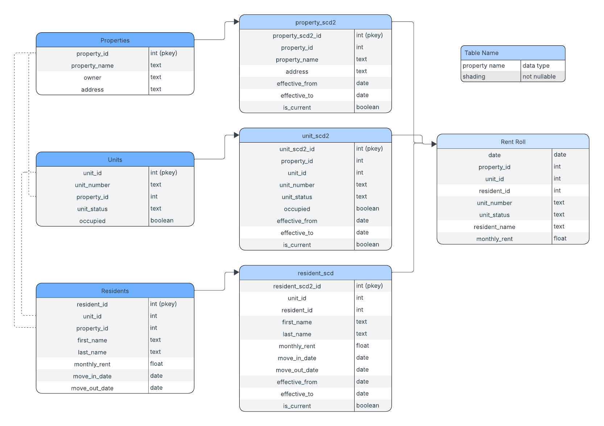

# Welltower Assessment
### Meghan Garrity, March 2026

## Prerequisites
- [Docker Desktop](https://www.docker.com/products/docker-desktop/)
- Everything runs in a docker container, so no other local installations are required.

## Setup

```bash
# 1. Clone the repo
git clone https://github.com/meggarrity/welltower.git
cd welltower

# or download the folder

# 2. Start all services (PostgreSQL, API, frontend)
docker compose up --build
```

| Service  | URL                          |
|----------|------------------------------|
| Frontend | http://localhost:3000        |
| API docs | http://localhost:8000/docs   |
| API      | http://localhost:8000        |


The API seeds fake data automatically on first start using the `LOAD_FAKE_DATA` flag. If you want to change the seed data settings, alter these variables in the docker_compose.yml file:

      LOAD_FAKE_DATA: "true"
      NUM_PROPERTIES: 3
      MIN_UNITS_PER_PROPERTY: 4
      MAX_UNITS_PER_PROPERTY: 1000
      RESIDENTS_RATIO: "0.7"

If you want to start with an empty database, change `LOAD_FAKE_DATA` to "false"

To rebuild with a fresh database:

```bash
docker compose down -v
docker compose up --build
```

## Stack

- FastAPI
- PostgreSQL
- Docker container
- pytest
- Next.js (React) frontend

## Database



My first plan was to create a single SCD2 table that joined all 3 tables' changes; properties, units, and residents, and then create the Rent Roll directly from that. However, the SCD2 table had a lot of awkward/illogical blank space (ex. how to track a resident who no longer is associated with a unit, null values for all resident fields in an inactive unit, etc). I decided to switch to one SCD2 table per attribute. 

|Source Table | SCD2 Table     |
|-------------|----------------|
| properties  | properties_scd2|
| units       | units_scd2     |
| residents   | residents_scd2 |

Each of these tables tracks current states per id, and they get joined to generate the rent roll.


I originally built a SQLite database, mainly because I already had the setup in place from a previous project. It worked fine until I needed to add triggers and scheduling for the rentroll. I moved my tables to PostgreSQL to allow for simpler triggers and pg_cron schedules to generate the rentroll. I went with triggers because they automatically track changes in the SCD2 tables, regardless of where the change comes from. This removes oversight burden and ensures consistency.

## Endpoint Usage Examples

The Swagger UI at `http://localhost:8000/docs` lets you try every endpoint interactively. These are just a few examples.

**Move in a new resident**
```bash
curl -X POST "http://localhost:8000/move_in?unit_id=1" \
  -H "Content-Type: application/json" \
  -d '{"first_name": "Jane", "last_name": "Smith", "rent": 3200, "move_in_date": "2024-06-01"}'
```

**Move an existing (previously moved-out) resident into a new unit**
```bash
curl -X POST "http://localhost:8000/move_in?unit_id=2&resident_id=5" \
  -H "Content-Type: application/json" \
  -d '{"rent": 3500}'
  ```

**Move out a resident**
```bash
curl -X POST "http://localhost:8000/move_out?resident_id=5&move_out_date=2024-12-31"
```

**Update rent (creates a new SCD2 history row)**
```bash
curl -X POST "http://localhost:8000/update_rent?resident_id=5&new_rent=3400"
```

**Take a unit out of service**
```bash
curl -X POST "http://localhost:8000/update_unit_status?unit_id=3&new_status=inactive"
```

**Rent roll for a property over a date range**
```bash
curl "http://localhost:8000/rentroll/1?start_date=2024-01-01&end_date=2024-01-31"
```

**KPIs by month for a date range**
```bash
curl "http://localhost:8000/kpis/2024-01-01/2024-12-31"
```

**Properties at a Glance**
```bash
curl "http://localhost:8000/overview/"
```

## Rent Roll

Rent roll is built on startup by backfilling from the earliest SCD2 record through today, and a nightly pg_cron job appends each new day at midnight. The `ON CONFLICT DO NOTHING` constraint makes both operations safe to re-run without damaging the integrity of the table.

Each row is a snapshot: the SCD2 tables are joined on `effective_date`/`expiration_date` ranges to find the correct version of each unit and resident for that specific date. This trusts that rent changes, unit status changes, and resident moves are all reflected accurately in historical rows — not retroactively updated.

Vacant units appear on every day within their active period with null resident fields and $0 rent.

The tradeoff of pre-materializing the rent roll (vs. computing it on the fly) is that queries are fast simple table scans, but the table must stay in sync if source data is amended. `recompute_rentroll_for_unit` is my current workaround for a synced rent roll. I don't know that I would want to use this solution at scale, because it would become costly in a system with lots of retroactive changes; however, in the spirit of good faith users, I chose to trade off this compute cost with the cost of building a rent roll table on the fly.  Theoretically, most data would be entered correctly at the time of entry, with limited revisions needed. This means that the rent roll gets built daily, and edited when a change is made that affects historic data. When a change (patch) is made, it triggers the rent roll recomputation for that unit.


## Testing

`docker-compose --profile test build test && docker-compose --profile test run --rm test`

While a lot of my testing was manual (executing an endpoint and evaluating the result in the UI), I made a suite of unit tests that assess expected behavior on a mock db using assertions. Tests can be run using `docker-compose --profile test run --rm test`. Since this is a locally-running project, I focused on isolated integration tests and manual tests.

## Assumptions

- An occupied unit never has rent = 0
- An inactive unit can not be occupied
- Move ins require either an existing resident, or first name, last name, rent, and move in date
- Move outs can not happen before move ins
- 1:1 resident:unit relationship (no unit with two tenants or tenant with two units)
- A patch update to a previous field should be logged in its respective scd2 table
- Deletions are not an option currently. Break glass behaviors became complex in light of interacting tables, and I chose to forgo the headache in favor of allowing robust updates and patches if needed. A future version would consider the best course for deletions, but in a model that realistically is being rebuilt each time it spins up, this did not feel like a priority

## If I had more time and resources

- Orchestration tool instead of triggers to update SCD2 tables
- Snowflake-backed db
  - database persistence (does not apply for local simulation)
- more refined endpoints to match actual user needs
  - not all db functionality likely needs to be surfaced to the API
- Consolidate some multi-step processes into single actions
  - ex. move a resident into a different unit and inactivate the previous unit (for repairs etc)
  - ex. batch raise rents at fixed intervals by a fixed amount
- more user-friendly inputs. Currently, strings and quotes are particular and difficult to work with
- UI improvements
  - interactive tables, click in options for more granular views
  - the current UI was built largely for myself so I could see results more clearly as I worked


## Claude Acknowledgements

Primarily helped with:
- seed data
- frontend
- check over unit tests and edge cases
- feedback on my KPI function